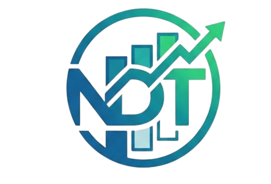

<div align="center">



# 🚀 NDT Task — Frontend

**A multi-platform Task Management SaaS** — Workspace → Board → Task, supporting both **Kanban** and **Scrum**.
Built with Next.js (App Router), Redux Toolkit + RTK Query, realtime via Socket.IO.

[](https://nextjs.org)
[](https://www.typescriptlang.org)
[](https://tailwindcss.com)
[](https://redux-toolkit.js.org)

[Backend repo](https://github.com/nguyendotai/NDT-Task-Backend) · [Issues / feedback](../../issues)

</div>

---

## 📖 Overview

**NDT Task** is a lightweight Jira/Trello-style work management app: each **Workspace** (a team/project) has one **Board**, a Board is split into **Columns**, and each Column holds **Tasks**. A Workspace can be either **Kanban** (a continuous flow) or **Scrum** (organized into Sprints, with a Burndown/Velocity chart).

This repo is the **web UI** (Next.js, talks to the API from the [Backend repo](https://github.com/nguyendotai/NDT-Task-Backend)).

## ✨ Highlights

| Area | Features |
| :--- | :--- |
| 🔐 **Auth** | Email + password sign-up/sign-in, a **Continue with Google** button, optional **2FA (scan a QR code)** from Profile, forgot/change password |
| 🗂️ **Board** | Smooth Task/Column drag-and-drop (dnd-kit, optimistic updates), a Search + multi-criteria Filter bar, Priority/Type/Task-key badges, inline image & PDF preview for Attachments |
| 🏃 **Scrum** | A dedicated Backlog/Sprint board, **Burndown chart** & **Velocity chart** (recharts) |
| ⏱️ **Time Tracking** | Log work hours right inside the Task Detail Modal |
| 💬 **Collaboration** | Comments, Checklists, Labels, Watchers, a workspace-level **Activity** tab (audit trail), rich-text Docs |
| 🔔 **Notifications** | A realtime notification bell, configurable per notification type in Profile |
| ⚡ **Realtime** | Every change (Task/Column/Sprint/Comment...) syncs instantly for everyone with the same Workspace open via Socket.IO, with online/typing indicators |
| 🔍 **Search** | System-wide search that jumps straight into the matching Task; export a Task list to CSV |
| 🎨 **UI** | Dark/Light theme, a glassmorphism + brand-gradient design, fully responsive |

## 🛠️ Tech Stack

- **Framework**: [Next.js](https://nextjs.org) 16 (App Router, strict TypeScript)
- **State**: [Redux Toolkit](https://redux-toolkit.js.org) + **RTK Query** (all server data, cache/tags auto-invalidate)
- **UI**: Tailwind CSS v4, [shadcn/ui](https://ui.shadcn.com) (built on [Base UI](https://base-ui.com)), [Framer Motion](https://www.framer.com/motion)
- **Forms & validation**: React Hook Form + Zod
- **Drag-and-drop**: [dnd-kit](https://dndkit.com)
- **Charts**: [Recharts](https://recharts.org) (Burndown/Velocity)
- **Realtime**: [socket.io-client](https://socket.io)
- **Toast notifications**: [sonner](https://sonner.emilkowal.ski)
- **Rich text**: [Tiptap](https://tiptap.dev) (the Docs module)

## 📂 Project Structure

```
src/
├── app/              # Next.js App Router — Layout/Page/Route only, NO business logic
│   ├── (auth)/           # /login, /register, /forgot-password...
│   └── (dashboard)/      # /dashboard, /workspaces, /profile... (requires sign-in)
├── features/          # Domain logic + API, reusable across pages
│   ├── auth/ user/ workspace/ task/ sprint/ comment/ ...
│   └── each feature: api/ (RTK Query) · components/ · hooks/ · schemas/ (Zod) · types/
├── modules/           # UI that composes multiple features into a full screen
│   ├── board/            # Kanban/Scrum board, Task Detail Modal, Settings...
│   ├── dashboard/        # Home page, Profile
│   └── search/            # Search page
├── shared/             # Used by ≥2 features: components/ui (shadcn), hooks, lib, services
├── store/              # Redux store setup
└── configs/            # Env vars, socket configuration
```

## 🚀 Getting Started

### Requirements

- Node.js 20+
- The [Backend API](https://github.com/nguyendotai/NDT-Task-Backend) already running (local or deployed) — the Frontend can't function on its own

### Installation

```bash
npm install
cp .env.example .env.local   # then fill in real values (see the table below)
npm run dev                   # http://localhost:3000
```

### Environment variables (`.env.local`)

| Variable | Description |
| :--- | :--- |
| `NEXT_PUBLIC_API_URL` | The Backend API's base URL, e.g. `http://localhost:5000/api/v1` |
| `NEXT_PUBLIC_SOCKET_URL` | The Backend's Socket.IO URL (usually the Backend's domain, without `/api/v1`) |
| `NEXT_PUBLIC_GOOGLE_CLIENT_ID` | Enables the "Continue with Google" button — leave blank and it hides itself |

> ⚠️ **Deployment note** (Vercel, etc.): `NEXT_PUBLIC_*` variables are baked into the bundle **at build time**, not read at runtime — after changing one on your hosting dashboard you must **redeploy** (without the build cache) for it to take effect.

### Handy scripts

```bash
npm run dev      # Run the dev server with hot-reload
npm run build     # Production build
npm run start      # Run the built app
npm run lint       # ESLint
```

## 🔗 Related repos

- **Backend**: [github.com/nguyendotai/NDT-Task-Backend](https://github.com/nguyendotai/NDT-Task-Backend)
